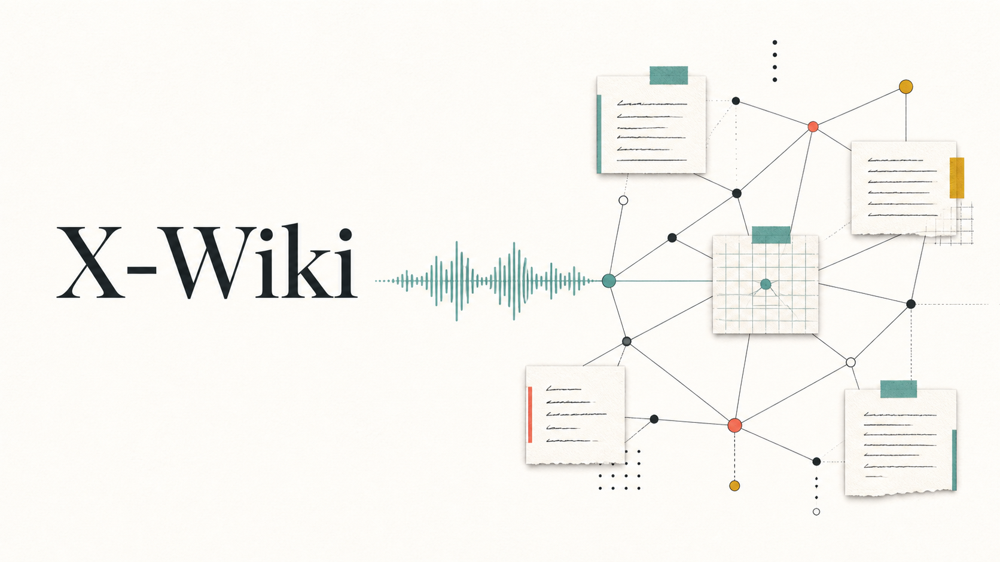

# X-Wiki

把低摩擦的语音捕捉，转化为可追溯、可连接、会持续生长的长期知识。iPhone 负责记录，Mac 在本地完成转写和编译，公开页面只呈现知识层。

  
<strong>本地转写</strong>Apple MLX · Whisper Large V3 Turbo

  
<strong>知识编译</strong>pi · iagent/standard · x-wiki-compiler

  
<strong>发布边界</strong>GitHub Pages 仅发布 Wiki，raw 留在本机

## 从这里进入

- [[wiki/synthesis/voice-to-knowledge-compiler|语音到知识编译器]]

  从捕捉、证据、转写到长期概念的完整方法。

- [[wiki/concepts/freedom-and-necessity|自由与必然]]

  认识客观规律之后，如何获得更有意识的行动自由。

- [[wiki/concepts/daily-operating-system|每日操作系统]]

  目标、健康、关系、储蓄、执行与情绪管理的日常结构。

- [[wiki/concepts/positioning-and-agency|位置与主动权]]

  从李斯的历史叙事中提炼场域选择、准备和主动权。

## 人物与关系

- [[wiki/entities/li-si|李斯]]：位置选择、信息过滤与关键机会。
- [[wiki/entities/xunzi|荀子]]：教育、独立思考与良师关系。
- [[wiki/entities/han-fei|韩非]]：眼界、友谊与思想交流。
- [[wiki/entities/lu-buwei|吕不韦]]：权力结构中的关键节点。

## 本地来源

以下证据用于知识编译，但不会进入公开 Git 仓库或 GitHub Pages：

- [[raw/voice/2025/02/2025-02-20-2351-189cd8db|李斯、荀子、韩非与吕不韦]]
- [[raw/voice/2025/02/2025-02-25-0840-ed71daf6|日常习惯与目标]]
- [[raw/voice/2025/05/2025-05-12-2144-e25f1768|自由与必然]]

## 待验证

- 如果未来 Voice Memos 出现可稳定读取的 Apple 原生 transcript，再加入优先提取。
- 对低置信度人名和历史细节，继续在 Wiki 层保留不确定性，不反向修改 raw。
